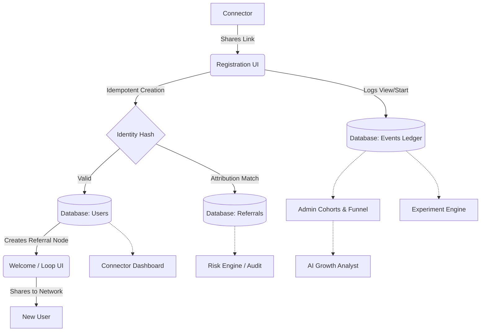

# GrowthOS
**NxtWave Growth Intern Challenge**

## Product Thesis
GrowthOS is a measurable growth system designed to hit 500 verified final-year engineering student registrations in 7 days with a ₹2,000 budget. 
Instead of building a static landing page and hoping for traffic, GrowthOS treats the workshop as a **network problem**. We seed trusted campus nodes (connectors), turn every registrant into a referral node, instrument every touchpoint, and use data + AI to reallocate effort toward the highest-leverage communities.

## Architecture
The system is built as a modular monolith.
- **Frontend**: Next.js (App Router), Tailwind CSS
- **Database**: SQLite (local) / PostgreSQL (production compatible via Prisma ORM)
- **State/Tracking**: Idempotent append-only event ledger

## Setup & Local Development
1. **Clone the repo:** `git clone https://github.com/Srinidhi-070/nxtwave-growthos.git`
2. **Install dependencies:** `npm install`
3. **Database setup:**
   This prototype uses a local SQLite database for zero-config demo capability.
   Run `npx prisma db push` to generate the `dev.db` file and `npx prisma generate` to build the client.
4. **Run the server:** `npm run dev`

### Environment Variables
For local testing, no environment variables are strictly required due to the SQLite provider. To deploy, set:
- `DATABASE_URL="postgres://..."` (if swapping Prisma to Postgres)
- `USE_REAL_AI="false"` (set to `true` to hook in OpenAI/Anthropic instead of the deterministic mock)

## Core Domains & Rules

### Event Taxonomy
All critical state changes are written to the `tracking_events` table:
- `landing_view`, `registration_started`, `registration_completed`
- `share_clicked`, `calendar_added`, `experiment_exposure`

### Attribution Rules
- Unique code provided at registration binds deterministic parent-child relationship.
- First-click and last-click are tracked.
- Self-referrals are invalid.
- Identity overlaps are flagged by the risk engine.

### Fraud & Risk Engine
Simple composite scoring runs over the event and referral tables.
- Duplicate identities (same hash) are rejected entirely.
- Shared IP/Device (stubbed) and high-velocity loops generate `RiskFlags`.
- Any flag over score 60 requires manual human approval via the Admin Command Center (`abuse_audit` table logs the exact actor and reason).

### Experiment Framework
Stable hash-based variant assignment based on `userId + experimentKey`.
- Supports A/B splits.
- Primary metrics tracked via the event ledger.

### AI Safety & Grounding
- **Evidence-Bound:** The AI Analyst (`MockAIProvider` / `RealAIProvider`) receives a strict payload of metrics and cohorts. It must cite explicit evidence numbers to back its claims.
- **Human in the loop:** High-impact suggestions (like scaling a campaign) return `human_approval_required: true`. It cannot arbitrarily mutate system state.

## Demo Instructions
1. Open the **Admin Command Center** at `/admin`.
2. Use the **Scenario Selector** dropdown in the header to pick a scenario (e.g., "Referral Lift" or "Fraud Spike").
   *(This wipes the DB and seeds 500-800 students, 5k+ events, and calculates real aggregates).*
3. Observe the Funnel, Channels, and Cohorts update dynamically.
4. Visit `/dashboard` to see how a Connector views their own metrics.
5. Visit `/register` to see the sign-up flow.
6. Visit `/admin/risk` to review flagged fraud cases.
7. Visit `/admin/experiments` to see A/B test results.

**Real vs Simulated:**
The *logic, tracking engine, idempotent APIs, risk scoring, and dashboards* are **100% real**. 
The *data rows* generated via the Scenario selector are **synthetic** (explicitly marked with the DEMO DATA badge).

## Demo Script (3-Minute Run)
1. Hit `/admin`, pick "Baseline" Scenario. Show Funnel loading.
2. Go to `/dashboard`. Show connector metrics (registrations, code).
3. Copy link, open Incognito `/register?ref=CONN...`.
4. Register a student.
5. Watch them land on `/welcome`, click share (triggers event).
6. Go back to `/admin`, show KPI +1 increment.
7. Hit "Fraud Spike" scenario. Open `/admin/risk` and reject a fraud loop.
8. Go to `/admin/experiments` to view deterministic variant assignment.
9. End at `/admin/ai` to read the AI growth suggestion based on evidence.

## Known Limitations
- SQLite restricts some heavy temporal joins; an enterprise version would leverage Postgres Timescale/Materialized Views.
- AI Provider is deterministic by default.
- UI doesn't have true role-based Auth gating (JWT) implemented for the prototype.
